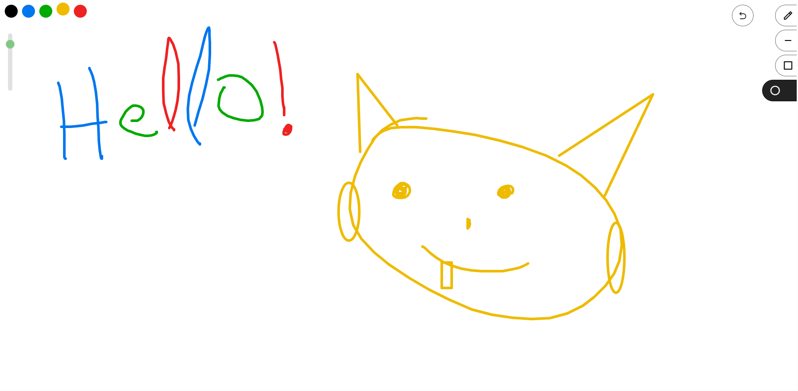

## Realtime Whiteboard

## Installation

Before proceeding the installation, make sure that [Bun](https://bun.sh) is installed in your machine. This app has not been tested with node or deno, so make sure to use bun.js.

- Clone the repo
- `bun install`
- `bun run dev` to view the application in development mode
- `bun run build && bun run preview` to view the application in production mode
- Goto [localhost:5173](http://localhost:5173) to view the application

Each URL/room is realtime and can be shared with friends. They are persistent. 
